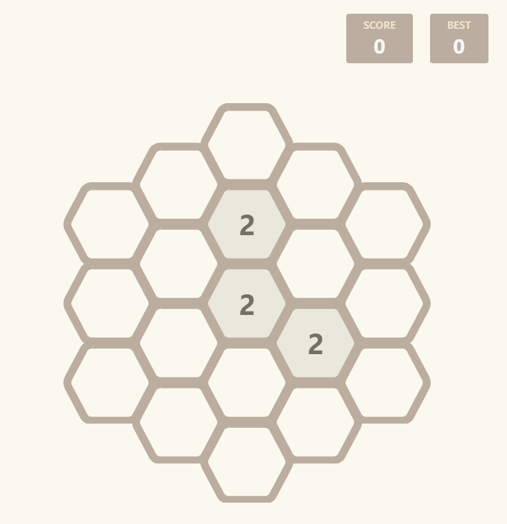

# Hexagonal 2048

This is a [2048](https://play2048.co/) clone game on a Hexagonal grid made with Typescript and React.
This is a clone of the classic [2048 game](https://play2048.co/) presented on a Hexagonal grid, created using Typescript and React.

Play it here: https://feralonsomaccari.github.io/2048-hexagon/

## Description

Features:
- Various game sizes (up to 6) that you can choose by clicking the "New Game" button
- Smooth animations
- Styling inspired by the original 2048 game
- Score tracking system
- Max Score tracking system
- Undo functionality
- Unit Tests

I had a lot of fun with this project and definitely learned a lot from it; Specially about the hexagonal topic which was something new for me and made me want to dive into different concepts and algorithms. The [cube coordinates](https://www.redblobgames.com/grids/hexagons/#coordinates-cube) was a nice reading.

