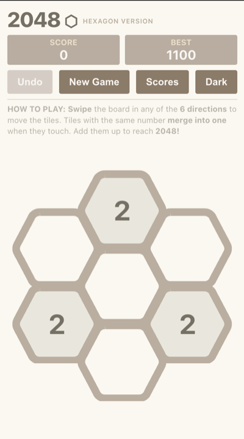

# 2048 Hexagon

A hexagonal twist on the classic [2048](https://play2048.co/) puzzle game. Slide and merge tiles across a hex grid to reach 2048.

**[Play it here →](https://2048hexagon.com)**



## How to play

Combine tiles of the same number by sliding the board in one of six directions. When two matching tiles meet, they merge into one with double the value. Keep merging to reach **2048** (512 in small).

### Features

- Two board sizes — **Small** (7 cells) and **Normal** (19 cells) — selectable from the **New Game** menu
- Personal best per board persisted in `localStorage`
- Light/dark theme with system-preference detection
- Accessible: keyboard-first controls, ARIA live regions, dialog focus management

### Spawn rules

Each board picks a different cadence and tile-value mix so the difficulty curve fits the size.

| Board  | Cells | Starter spawn | Per-turn spawn count                  | Spawned tile values |
| ------ | ----- | ------------- | ------------------------------------- | ------------------- |
| Small  | 7     | 2 × `2`       | 1 tile                                | 100% `2` · 0% `4`   |
| Normal | 19    | 3 × `2`       | 50% chance of 1 tile · 50% of 2 tiles | 80% `2` · 20% `4`   |

Small never spawns a `4` — board pressure already comes from running out of space, so a stray high-value tile would be pure friction. Normal can spawn 4s and occasionally adds two tiles at once to keep the larger board filling up.

## Tech stack

- **React 18** + **TypeScript**
- **Vite**
- **CSS Modules** for scoped styling
- **Firebase Firestore** for the leaderboard
- Deployed to **GitHub Pages** via `gh-pages`

## Local development

Requires Node ≥ 20.19 and npm ≥ 9.

```bash
npm i
npm run dev
npm run test:watch # run tests in watch mode
```

## Notes on the hex math

The grid uses **cube coordinates** (`x + y + z = 0`) — three axes for the six neighbour directions instead of two for a square grid. Red Blob Games' [Hexagonal Grids guide](https://www.redblobgames.com/grids/hexagons/#coordinates-cube) is an excellent reference and was the basis for the movement and merge logic here.

## Credits

- Based on the original **[2048](https://play2048.co/)** by [Gabriele Cirulli](https://github.com/gabrielecirulli).
- Hex coordinate math adapted from [Red Blob Games](https://www.redblobgames.com/grids/hexagons/).
