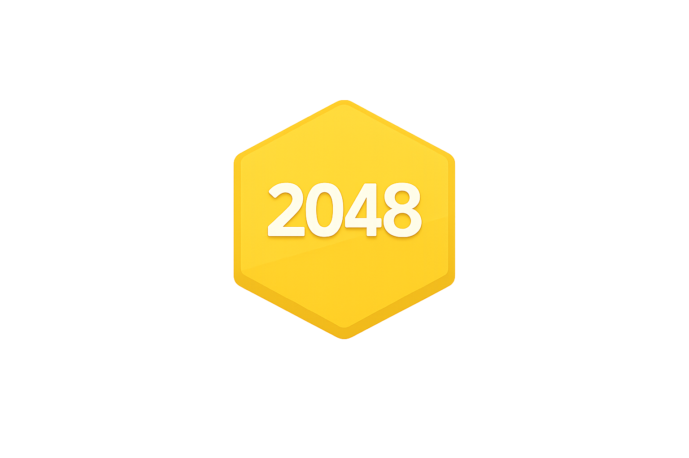

# 2048 Hexagon

A hexagonal twist on the classic [2048](https://play2048.co/) puzzle game. Slide and merge tiles across a hex grid to reach 2048.

**[Play it here →](https://feralonsomaccari.github.io/2048-hexagon/)**



## How to play

Combine tiles of the same number by sliding the board in one of six directions. When two matching tiles meet, they merge into one with double the value. Keep merging to reach **2048**.

### Controls

| Direction  | Keys                  |
| ---------- | --------------------- |
| Up-left    | `Q` &nbsp;/&nbsp; `←` |
| Up         | `W` &nbsp;/&nbsp; `↑` |
| Up-right   | `E`                   |
| Down-left  | `A`                   |
| Down       | `S` &nbsp;/&nbsp; `↓` |
| Down-right | `D` &nbsp;/&nbsp; `→` |

### Features

- Four board sizes (7, 19, 37, or 61 cells) selectable from the **New Game** menu
- Per-size high-score tracking persisted in `localStorage`
- One-step undo
- Smooth tile movement and merge animations
- Accessible: keyboard-first controls, ARIA live regions, dialog focus management

## Tech stack

- **React 18** + **TypeScript**
- **CSS Modules** for scoped styling
- **Jest** + **React Testing Library** for unit tests
- **Create React App** (react-scripts 5)
- Deployed to **GitHub Pages** via `gh-pages`

## Local development

Requires Node ≥ 15.5 and npm ≥ 7.3.

```bash
npm install
npm run dev      # start dev server at http://localhost:3000
npm test         # run the test suite
npm run build    # production build into ./build
npm run deploy   # publish ./build to GitHub Pages
```

## Notes on the hex math

The grid uses **cube coordinates** (`x + y + z = 0`) — three axes for the six neighbour directions instead of two for a square grid. Red Blob Games' [Hexagonal Grids guide](https://www.redblobgames.com/grids/hexagons/#coordinates-cube) is an excellent reference and was the basis for the movement and merge logic here.
